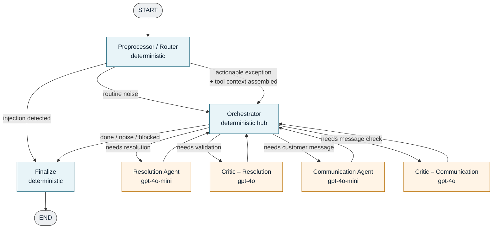
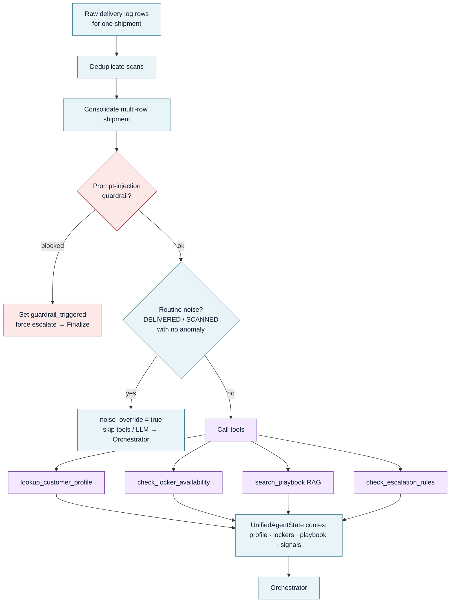
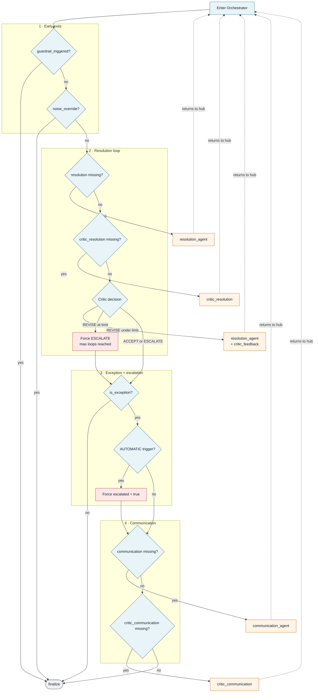
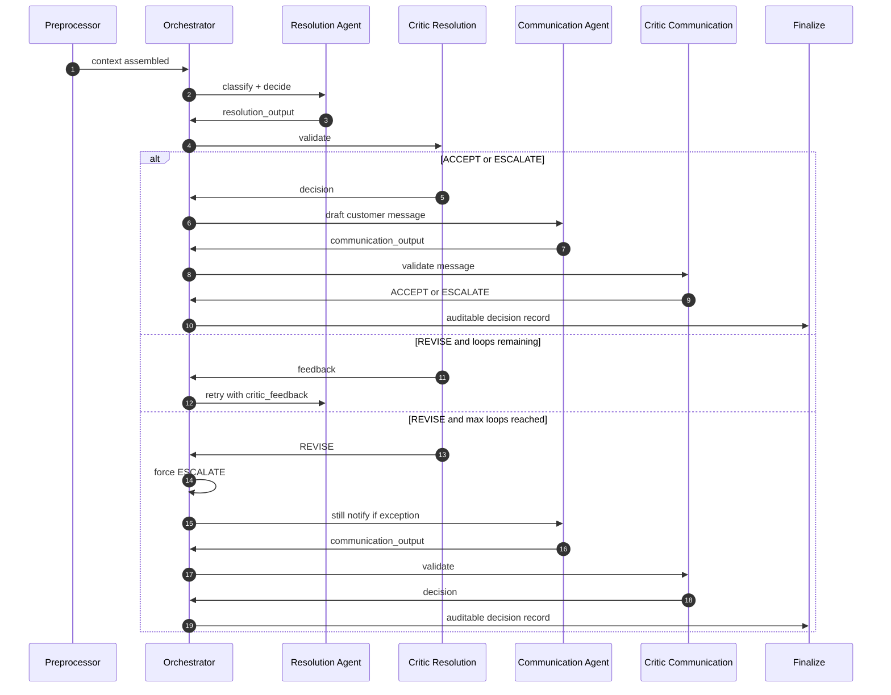
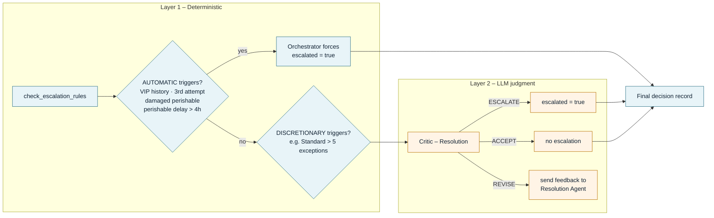

# Multi-Agent System Workflow

Hub-and-spoke LangGraph pipeline for last-mile delivery exception handling. Deterministic nodes enforce policy; LLM agents handle judgment.

## High-level flow

## Preprocessor internals

Runs before any LLM call. Deduplicates, consolidates, guards, and gathers context.

## Orchestrator routing logic

The orchestrator runs after every agent and picks exactly one next node.

## Happy path vs revision loop

Sequence diagram: time flows top → bottom; participants sit across the top.

## Two-layer escalation

## Components at a glance

| Component | Type | Responsibility |
|:---|:---|:---|
| **Preprocessor** | Deterministic | Dedup, consolidate, injection guardrail, noise filter, tool calls |
| **Orchestrator** | Deterministic | Hub router; enforces flow, revision cap, AUTOMATIC escalation |
| **Resolution Agent** | LLM (`gpt-4o-mini`) | Classify exception; choose RESCHEDULE / REROUTE_TO_LOCKER / REPLACE / RETURN_TO_SENDER |
| **Critic – Resolution** | LLM (`gpt-4o`) | ACCEPT / REVISE / ESCALATE; owns discretionary escalation |
| **Communication Agent** | LLM (`gpt-4o-mini`) | Personalized notification (only agent that sees customer name) |
| **Critic – Communication** | LLM (`gpt-4o`) | ACCEPT / ESCALATE on tone, accuracy, privacy |
| **Finalize** | Deterministic | Auditable decision record + end-to-end latency |

## Design notes

- **Hub-and-spoke:** every worker returns to the Orchestrator so routing stays explicit and logged.
- **Revision bound:** Resolution ⇄ Critic loops are capped (`max_loops = 2`); exhaustion forces escalation.
- **Noise is free:** routine events never reach an LLM.
- **Policy vs judgment:** unambiguous playbook rules live in code; nuance (driver notes, damage severity, discretionary escalation, message quality) stays with LLMs.
